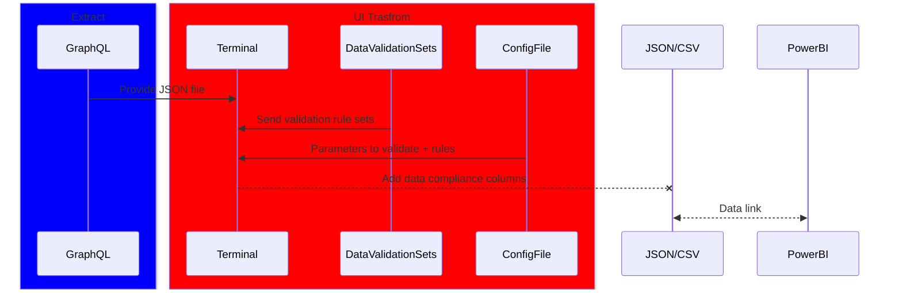

# Proof of concept for Data Validation of a Jason File

this small repo contain a small part of a bigger project. 
the goal is be able to easaly check the the data in a Json file and add what is compliant accordingaly to a confif file. 

the result will be added to a powerBi dashboard to red flag infoamtion that are not complaint. 

